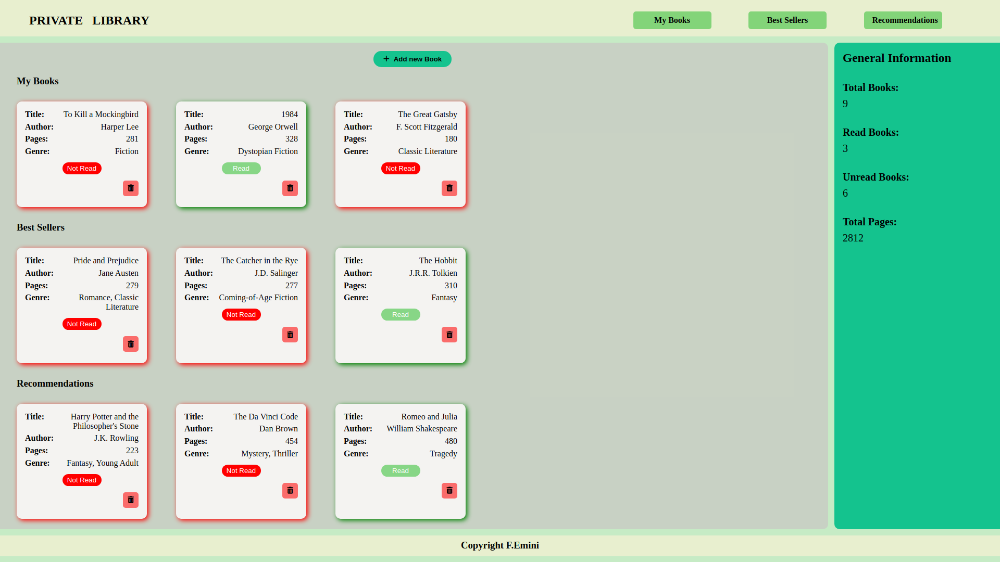

# Library Project

This project is part of The Odin Project's curriculum and aims to create a library application where users can keep track of their books. Users can add new books, mark books as read or unread, and delete books from their library.

## Preview

## Live Demo
Check out the live demo [HERE](https://fatbardheminii.github.io/library-TOP/).

## Technologies Used
- HTML
- CSS
- JavaScript

## Features
- Responsive design, ensuring optimal viewing experience across a wide range of devices.
- Users can add new books, mark them as read or unread, and delete books.
- Sidebar displays additional information about the library's statistics.
- Utilizes Font Awesome icons for enhanced visual appeal.

## How to Use
1. Clone this repository to your local machine.
2. Open the `index.html` file in your web browser.
3. You can add new books by clicking the "Add new Book" button and filling out the form.
4. Books are displayed in rows based on their category (My Books, Best Sellers, Recommendations).
5. You can mark books as read or unread by clicking the corresponding button on each book card.
6. To delete a book, click the delete button on the book card.
7. On smaller screens, the sidebar containing additional information is hidden. Instead, users can click the info icon to open the sidebar and view statistics about their library.
   
## Contributions
Contributions are welcome! Feel free to submit pull requests or raise issues for any improvements or fixes.

## Credits
Developed by: [Fatbardh Emini](https://github.com/fatbardheminii)
